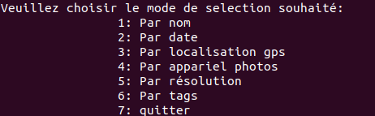

# Conception technique
## Dépendences 
le projet utilise la bibliothèque externe rexiv2 (version 0.9.0). Cette dépendance est disponible sur crates.io.

```toml
[dependencies]
rexiv2="0.9.0"
```
Cette bibliothèque fournit un wrapper Rust de la bibliothèque gexiv2, qui est elle-même un wrapper basé sur GObject de la bibliothèque Exiv2, qui fournit un accès en lecture et en écriture aux métadonnées Exif, XMP et IPTC pour les fichiers multimédias dans différents formats.

Étant donné que la bibliothèque rexiv2 est lié à gexiv2 et transitivement à Exiv2, rexiv2 dépend évidemment d'eux (et de leurs dépendances). L'installation de ces bibliothèques sur le système est une condition préalable à l'utilisation de rexiv2 ou de tout logiciel construit sur celle-ci.

# Sénario
Dans le sénario on va montrer le résultat de chaque fonctionnalités de l'application .
Tout d'abord l'application propose à l'utilisateur de choisir un mode de séléction 

* La sélection par le nom : Quand l'utilisateur choisit le mode séléction par nom l'application lui propose d'entrer un nom pour séléctioner les photos qui ont le meme pseudo
* La sélection par  date : Quand l'utilisateur choisit le mode séléction par date l'application lui propose d'entrer un date selon une format précise pour séléctioner les photos qui ont la meme date
* La sélection par  localisation  :Quand l'utilisateur choisit le mode séléction par localisation l'application lui propose d'entrer les paramètres suivant:longitude, latitude et altitudee pour séléctioner les photos qui ont la meme localisation
* La sélection par nom de l'appareil photo ou la camera  :Quand l'utilisateur choisit le mode séléction par appareil l'application lui propose d'entrer son nom afin d'afficher les photos prisent par la meme appareil
* La sélection par résolution:Quand l'utilisateur choisit le mode séléction par l'application lui propose d'entrer la résolution x et la résolution y pour afficher les photos qui ont la meme résolution
 * La sélection par tags:Quand l'utilisateur choisit le mode séléction par tags l'application lui propose d'entrer un tag pour séléctioner les photos qui ont le meme tag
